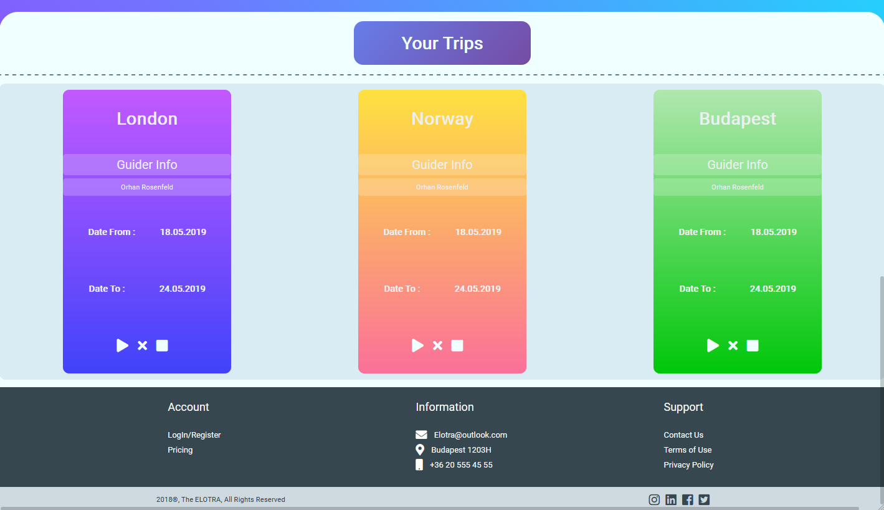
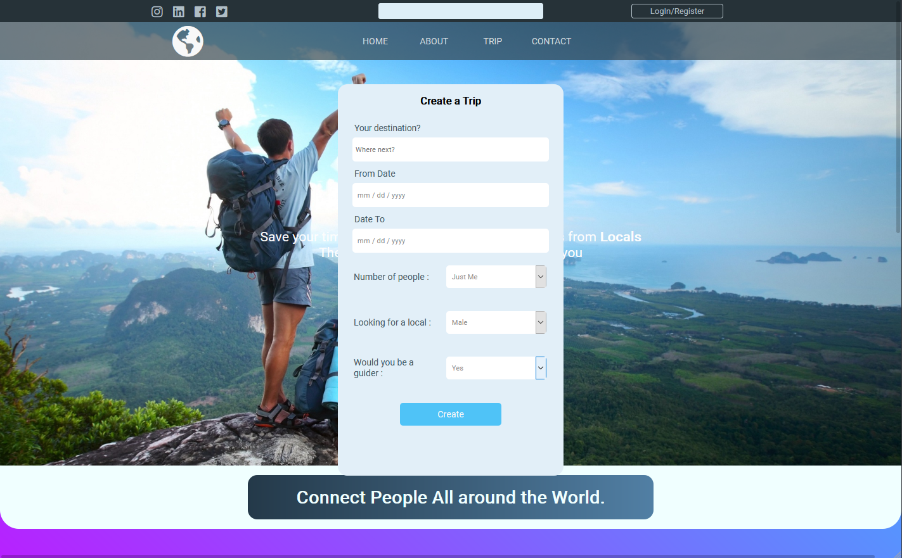

# Elotra

  During the project as we had less time, mobile responsiveness was not the priority. Therefore, if some pages do not not scale well or respond properly on different screen resolutions, it is because the project was intented to be a prototype and some part of the project was hard coded.    

## Screenshots :: index.html

  

## Screenshots :: trip.html

  

## Screenshots :: trip.html -> javascript carousel

  

## Screenshots :: trip.html -> registration

  

### Note
  trip.html has an implemented javascript carousel towards the bottom of the page. Therefore you can swipe left and right just to have a bit of fun. 
